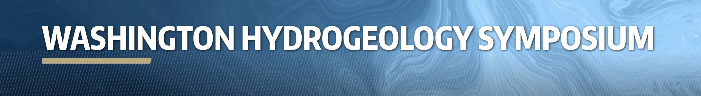

# Python for Hydrogeology
Training materials for the Python and Hydrogeology Workshop offered during the [2026 Washington Hydrogeology Symposium](https://wahgs.uw.edu/)

## Date and Location
* Conference: May 11-14, 2026
* Workshop is on Thursday, May 14, 2026
* Hotel Murano, Tacoma, WA

## Course Description
MODFLOW is a free, open-source, and widely used groundwater modeling program relied upon by government scientists, academic researchers, and private consultants to address complex groundwater flow and transport problems. It is commonly used to answer questions such as: How will groundwater levels respond to pumping or changes in recharge? What are the impacts of groundwater withdrawals on streams, lakes, and wetlands? How do contaminants or heat move through aquifer systems? How effective are management or remediation strategies under current and future conditions?  MODFLOW provides a flexible, well-tested framework for evaluating these questions in a rigorous, quantitative manner and is routinely used to support real-world groundwater management and decision-making.

The purpose of this one-day workshop is to provide an overview of the latest version of the U.S. Geological Survey MODFLOW program (MODFLOW 6) and demonstrate how models are developed using the Python-based FloPy package. The workshop will combine short lectures of underlying concepts with practical, hands-on exercises to demonstrate modern workflows for constructing, running, and post-processing groundwater models.

## Instructor
* [Christian Langevin, SSP&A](https://sspa.com/christian-langevin-phd/)

## Who Should Attend
This workshop is intended for:
* Hydrogeologists, hydrologists, and water-resources professionals
* Consultants and regulators involved in groundwater assessment, management, or remediation
* Managers interested in developing a deeper understanding of how groundwater models work
* Environmental scientists and engineers working with groundwater data and models
* Graduate students and advanced undergraduates with an interest in groundwater modeling

Participants should have a basic understanding of groundwater concepts. Prior experience with MODFLOW or Python is helpful but not required.

## Topics

Topics that will be covered include the following:

* MODFLOW overview
* Getting started with FloPy
* Groundwater flow simulation
* Groundwater transport simulation
* Automating repetetive modeling tasks
* Introduction to advanced MODFLOW capabilities

## Software
This workshop consists of hands-on exercises designed improve overall groundwater modeling proficiency with Python.  Participants will need to bring a laptop computer to the workshop with the required software already installed.  See the [Software Installation](./SOFTWARE.md) page for instructions on how to install the required software.
